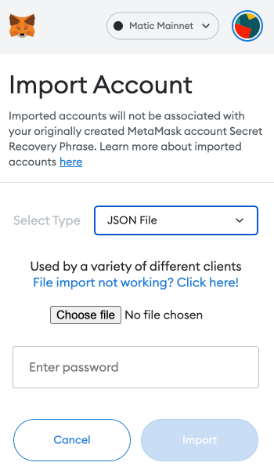
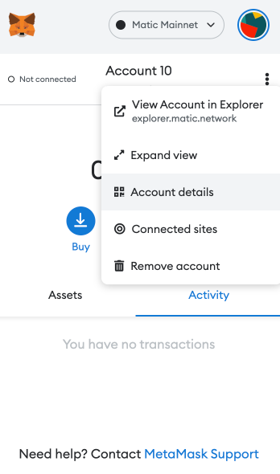
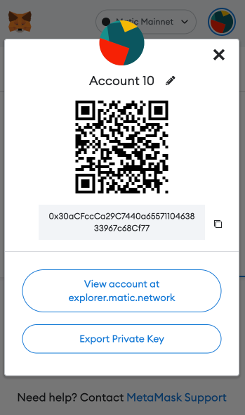

# dwarna Setup

## Setting up a blockchain

### Step 1: Create User

```bash
useradd -m -s /bin/bash dwarna
passwd -l dwarna
```

### Step 2: Install requirements

```bash
su dwarna && cd
#download homebrew
/bin/bash -c "$(curl -fsSL https://raw.githubusercontent.com/Homebrew/install/HEAD/install.sh)"
#add path
echo "PATH=$PATH:/home/dwarna/.linuxbrew/bin" >> ~/.bashrc
source ~/.bashrc
#check homebrew version
brew --version

#apt get update
sudo apt-get update
sudo apt install nodejs -y
sudo apt install npm -y

#install npm
npm i -g n
n 17.0.0
npm -v

#install ethereum
brew tap ethereum/ethereum
brew install ethereum

#install truffle and solc
sudo npm install -g truffle
sudo npm install -g solc
```

### Step 3: Creating genesis file

```bash
cd
mkdir dwarna-eth-chain
cd dwarna-eth-chain
tee -a genesis.json << END
{
  "config": {
    "chainId": 101010,
    "homesteadBlock": 0,
    "eip150Block": 0,
    "eip155Block": 0,
    "eip158Block": 0,
    "byzantiumBlock": 0,
    "constantinopleBlock": 0,
    "petersburgBlock": 0
  },
  "nonce": "0x0000000000000033",
  "timestamp": "0x0",
  "parentHash": "0x0000000000000000000000000000000000000000000000000000000000000000",
  "gasLimit": "0x20000000",
  "difficulty": "0x100",
  "mixhash": "0x0000000000000000000000000000000000000000000000000000000000000000",
  "coinbase": "0x3333333333333333333333333333333333333333",
  "alloc": {}
}
END
mkdir data
geth --datadir data init genesis.json
```

### Step 4: Starting node

```bash
sudo -i
tee -a /etc/systemd/system/dwarna-eth-chain.service << END
[Unit]
Description=Dwarna ETH Chain Service

[Service]
Type=simple
User=dwarna
Restart=always
ExecStart=/home/dwarna/geth/geth --port 3000 --networkid 101010 --nodiscover --datadir=/home/dwarna/dwarna-eth-chain/data --maxpeers=1 --http --http.port 8543 --http.addr 0.0.0.0 --http.corsdomain "*" --http.api "eth,net,web3,personal,miner,admin" --rpc.allow-unprotected-txs --allow-insecure-unlock --nat none --metrics --metrics.addr 0.0.0.0 —password=/home/dwarna/.pwd —unlock=0x2de689df983e7a12389829da436c3e3395635df0 --mine --miner.threads=8

[Install]
WantedBy=multi-user.target
END
systemctl daemon-reload
systemctl enable dwarna-eth-chain
systemctl start dwarna-eth-chain
```

### Step 5: Monitoring

```bash
sudo apt-get update
sudo apt-get install ca-certificates curl gnupg lsb-release
 
curl -fsSL https://download.docker.com/linux/ubuntu/gpg | sudo gpg --dearmor -o /usr/share/keyrings/docker-archive-keyring.gpg
echo "deb [arch=$(dpkg --print-architecture) signed-by=/usr/share/keyrings/docker-archive-keyring.gpg] https://download.docker.com/linux/ubuntu $(lsb_release -cs) stable" | sudo tee /etc/apt/sources.list.d/docker.list > /dev/null
 
sudo apt-get update
sudo apt-get install docker-ce docker-ce-cli containerd.io -y
 
sudo docker run hello-world
sudo usermod -aG docker dwarna

docker run -d --name node-exporter --restart always   --net="host"   --pid="host"   -v "/:/host:ro,rslave"   quay.io/prometheus/node-exporter:latest   --path.rootfs=/host

cd
docker pull prom/prometheus
tee -a prometheus.yml << END
global:
  scrape_interval:     15s # Set the scrape interval to every 15 seconds. Default is every 1 minute.
  evaluation_interval: 15s # Evaluate rules every 15 seconds. The default is every 1 minute.
  # scrape_timeout is set to the global default (10s).

# A scrape configuration containing exactly one endpoint to scrape:
# Here it's Prometheus itself.
scrape_configs:
  - job_name: 'dwarna-eth-chain-node-1'
    metrics_path: '/debug/metrics/prometheus'
    static_configs:
    - targets: [':6060']
  - job_name: 'dwarna-eth-chain-node-1-system'
    static_configs:
    - targets: [':9100']
END

docker run -d --restart always --name prometheus -p 9090:9090 --ip=172.17.0.2 -v /home/dwarna/prometheus.yml:/etc/prometheus/prometheus.yml prom/prometheus --config.file=/etc/prometheus/prometheus.yml
docker run -d --restart always --name grafana -p 3001:3000 grafana/grafana
```

## Useful Geth commands

### To start geth

```bash
geth attach http://127.0.0.1:8543
```

#### To get peer
```bash
admin.nodeInfo.enode
```

#### To add peer
```bash
admin.addPeer("PeerID")
```

#### To start miner
```bash
miner.start()
```

#### To stop miner
```bash
miner.stop()
```

#### To create an account
```bash
personal.newAccount('passphrase')
```

#### To unlock an account
```bash
personal.unlockAccount(web3.eth.coinbase, "passphrase", 15000)
```

## Deploying Smart Contracts onto Private Blockchain

#### Step 1: Init Truffle

```bash
cd
#create a folder named truffle
mkdir truffle
cd truffle
truffle init
```

#### Step 2: Place the contracts into truffle/contracts

Copy the source .sol files into the folder named contracts 

#### Step 3: Create a migrations file

```bash
#go to the migrations directory
cd /home/node/truffle/migrations
#create file
tee -a 2_create_dwarna.js << END
var DwarnaData = artifacts.require("./DwarnaData.sol");
var Dwarna = artifacts.require("./Dwarna.sol");
module.exports = async(deployer) => {
   console.log("Deploying Data contract")
   let dwarnaData = await deployer.deploy(DwarnaData);
   console.log("Deploying Logic contract")
   let dwarnaLogic = await deployer.deploy(Dwarna, DwarnaData.address);

   console.log("Setting Logic Address to Data Contract")
   let dwarnaDataContract = await DwarnaData.deployed();
   let setAddress = await dwarnaDataContract.changeLogic(Dwarna.address);
};
END
```

#### Step 4: Compile & Migrate

```bash
truffle compile
truffle migrate
```

## Interacting with a contract

First open a console
```bash
cd /home/node/truffle
truffle console
```

Then run:

```js
var dataDapp
var dwarnaDapp
DwarnaData.deployed().then(function(instance) { dataDapp = instance; })
Dwarna.deployed().then(function(instance) { dwarnaDapp = instance; })
//get public variables like
dataDapp.logicAddress.call()
//call methods like
dwarnaDapp.createStudy("1")
dwarnaDapp.addConsentToStudy("1", "0xeAD297594EC8d673F3a5aE77871510B53D9A42D8")
```

## Getting the private key of an account created from geth

#### Step 1. Get the JSON key file

This should be in the folder <b>/home/node/dwarna/data/keystore</b> and the name of the file should start with <b>UTC</b>

#### Step 2. Import File into Metmask

Upload the file and enter the passphrase in the fields below. To arrive to this point, click on the circle located at the top-right of the popup and then choose 'Import Account'

</img>

#### Step 3. Export Private Key

Press the three dots and click on 'Account Details' as below

</img>

Then, press 'Export Private Key'

</img>

